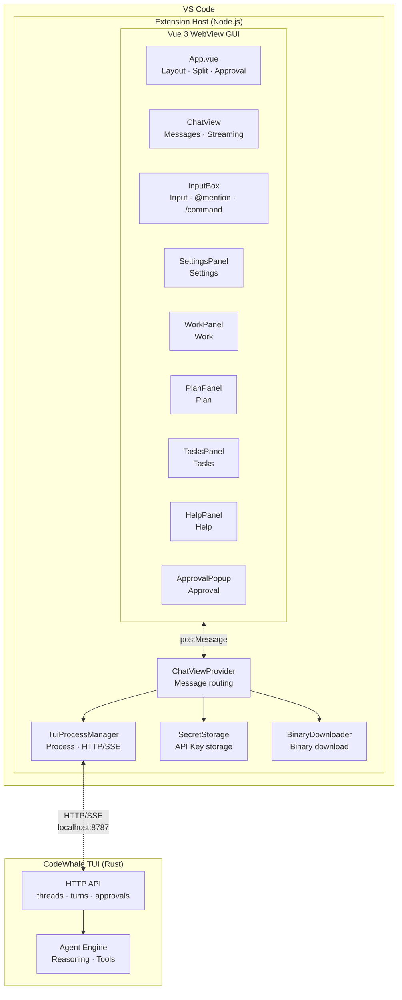

<p align="center">
  
</p>

<h1 align="center">Celest — DeepSeek V4 AI Agent for VS Code</h1>

<p align="center">
  Bring the full power of <a href="https://github.com/Hmbown/CodeWhale">CodeWhale TUI</a> into VS Code<br>
  Native HTTP/SSE streaming · Tool execution · Thinking visualization · Multi-panel
</p>

<p align="center">
  <a href="README.md">简体中文</a> | English
</p>

---

## ✨ Features

| Feature | Status |
|---------|:------:|
| 💬 Streaming chat — real-time token-by-token rendering | ✅ |
| 🧠 Thinking visualization — reasoning stream, collapsible | ✅ |
| 🔧 Tool execution — tool call cards (collapse, status, result preview) | ✅ |
| 📋 Work panel — todo_write parsing, task checklist | ✅ |
| 📐 Plan panel — update_plan parsing, step progress | ✅ |
| 📌 Tasks panel — background task tracking | ✅ |
| 📁 @ mentions — workspace file autocomplete | ✅ |
| ⚡ / commands — 63 slash commands, A-Z sorted | ✅ |
| ❓ Help panel — commands + shortcuts reference | ✅ |
| 📂 Session list — TreeView with real Threads API data | ✅ |
| 🔐 Approval popup — confirm tool execution (allow/deny/trust session) | ✅ |
| 📄 Diff preview — View Diff → VS Code diff editor | ✅ |
| ⚙ Settings panel — General/Model/About tabs, secure API Key storage | ✅ |
| 🎛️ Model switching — 8-model dropdown, PATCH sync to current thread | ✅ |
| 🔀 Mode switching — Agent/Plan/YOLO one-click cycle, YOLO auto-approves | ✅ |
| 🌐 i18n — zh-CN / English UI switching | ✅ |
| 📥 Binary download — auto-download codewhale-tui from GitHub Releases | ✅ |
| 🖼️ Paste images — screenshot paste auto-saves as @path | ✅ |
| ⏹ Stop button — interrupt generation (interrupt API + fallback) | ✅ |
| 🔄 Auto-retry — exponential backoff on TUI crash | ✅ |
| 💾 Message persistence — localStorage debounced auto-save | ✅ |
| 🎨 VS Code theme — dark/light mode adaptation | ✅ |

## 📸 Screenshots

<p align="center">
  
  <br><em>Workspace — Chat + Work/Plan/Tasks panels</em>
</p>

<details>
<summary>⚙ Settings Panel</summary>
<p align="center">
  
  
  
</p>
</details>

## 📦 Installation

### Prerequisites

- **VS Code** ≥ 1.70.0
- **Node.js** ≥ 18.18.0
- **[CodeWhale TUI](https://github.com/Hmbown/CodeWhale)** ≥ 0.8.44 (must be in PATH, or use the built-in downloader)

### Steps

```bash
git clone https://github.com/TheEastKoi/celest.git
cd celest
npm install
npm run build
```

Then press `F5` in VS Code to launch the extension development host, or:

```bash
npx vsce package
code --install-extension celest-*.vsix
```

## 🚀 Usage

1. Open VS Code, click the 🌙 **Celest** icon in the sidebar
2. Wait for TUI to connect (auto-starts `codewhale-tui serve --http`)
3. Type in the input box, press `Enter` to send
4. Use `@` to mention files, `/` to browse commands
5. Right panel: Work / Plan / Tasks / Help
6. Click ⚙ to open Settings and configure model + API Key

### Keyboard Shortcuts

| Key | Action |
|-----|--------|
| `Enter` | Send message |
| `Shift+Enter` | New line |
| `↑↓` (in popup) | Navigate options |
| `Esc` | Close popup |
| `Ctrl+L` | Focus input |

### Common Commands

| Command | Description |
|---------|-------------|
| `/help` | Open help panel |
| `/clear` | Clear chat |
| `/compact` | Compact context |
| `/model` | Switch model |

> Type `/` to browse all 63 commands

## 🏗️ Architecture



## 📁 Project Structure

```
celest/
├── src/
│   ├── extension.ts              Entry point
│   ├── chatViewProvider.ts       WebView + message routing
│   ├── tuiProcessManager.ts      TUI process + HTTP/SSE Threads API
│   ├── sessionsTreeProvider.ts   Session TreeView
│   ├── secretStorage.ts          API Key secure storage
│   └── binaryDownloader.ts       GitHub Release binary download
├── gui/src/
│   ├── App.vue                   Root layout + split
│   ├── i18n.ts                   i18n (zh-CN/en)
│   └── components/
│       ├── ChatView.vue          Message list
│       ├── InputBox.vue          Input box
│       ├── SettingsPanel.vue     Settings panel
│       ├── ContextBar.vue        Status bar (model/mode)
│       ├── ApprovalPopup.vue     Approval popup
│       ├── WorkPanel.vue         Work panel
│       ├── PlanPanel.vue         Plan panel
│       ├── TasksPanel.vue        Tasks panel
│       └── HelpPanel.vue         Help panel
├── docs/
│   ├── PLAN.md                   Development plan
│   ├── INTEGRATION_TEST.md       Integration test cases
│   └── TEST_PLAN.md              Test plan
├── build.mjs                     esbuild script
└── package.json
```

## 🔧 Development

```bash
cd celest
npm install

# Build
node build.mjs

# Test
npx vitest run

# Press F5 to debug
```

## 📋 Development Phases

| Phase | Content | Status |
|-------|---------|:------:|
| 0 | Project skeleton | ✅ |
| 1 | TUI communication + Vue GUI | ✅ |
| 2 | Chat core (HTTP/SSE) | ✅ |
| 3 | @ / / panels + session list | ✅ |
| 4 | Approval + execution + Diff | ✅ |
| 5 | Settings + model/mode switching + i18n + binary download | ✅ |
| 6 | Full API + panels + tests | ✅ |
| 6.4 | Closed beta fixes (26 bug + 10 feature) | ✅ |

## 🔄 CodeWhale Migration

TUI v0.8.40 → v0.8.44 (CodeWhale). Celest is fully adapted.

| Item | Old | New |
|------|-----|-----|
| Binary | `deepseek-tui` | `codewhale-tui` |
| Port | 7878 | 8787 |
| Repo | `deepseek-ai/DeepSeek-TUI` | `Hmbown/CodeWhale` |
| API | Unchanged | Unchanged |

See [docs/PLAN.md](docs/PLAN.md)

## 📄 License

Apache-2.0

---

<p align="center">
  <sub>Made with 🌙 by <a href="https://github.com/TheEastKoi">TheEastKoi</a></sub>
</p>
