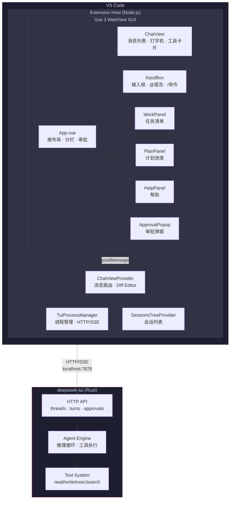

<p align="center">
  
</p>

<h1 align="center">Celest — DeepSeek V4 AI Agent for VS Code</h1>

<p align="center">
  将 <a href="https://github.com/Hmbown/DeepSeek-TUI">DeepSeek TUI</a> 的全部能力带入 VS Code<br>
  HTTP/SSE 原生流式 · 工具执行 · Thinking 可视化 · Work/Plan 面板
</p>

<p align="center">
  
</p>

---

## ✨ 功能

| 功能 | 状态 |
|------|:----:|
| 💬 流式对话 — 打字机效果，逐 token 渲染 | ✅ |
| 🧠 Thinking 可视化 — reasoning 实时流，折叠可展开 | ✅ |
| 🔧 工具执行 — 工具调用卡片（折叠、状态、结果预览） | ✅ |
| 📋 Work 面板 — 解析 todo_write 展示任务清单 | ✅ |
| 📐 Plan 面板 — 解析 update_plan 展示步骤进度 | ✅ |
| 📁 @ 提及 — 工作区文件自动补全 | ✅ |
| ⚡ / 命令 — 63 个斜杠命令，A-Z 排序，中文别名 | ✅ |
| ❓ Help 面板 — 64 命令 + 43 快捷键，分类展示 | ✅ |
| 📂 会话列表 — TreeView 真实数据（Threads API） | ✅ |
| 🔐 审批弹窗 — 工具执行前确认（允许/拒绝/信任会话），类 TUI 终端 UI | ✅ |
| 📄 Diff 预览 — View Diff 按钮打开 VS Code diff editor | ✅ |
| 🖼️ 粘贴图片 — 截图粘贴自动保存为 @path | ✅ |
| ⏹ Stop 按钮 — 中断生成（interrupt API + fallback） | ✅ |
| 🔄 自动重试 — TUI 崩溃指数退避重连 | ✅ |
| 💾 消息持久化 — localStorage 防抖自动保存 | ✅ |
| 🎨 VS Code 主题适配 — 暗色/亮色主题跟随 | ✅ |

## 📦 安装

### 前置条件

- **VS Code** ≥ 1.70.0
- **Node.js** ≥ 18.18.0
- **[deepseek-tui](https://github.com/Hmbown/DeepSeek-TUI)** ≥ 0.8.40（需已安装并在 PATH 中）

### 安装步骤

```bash
git clone https://github.com/TheEastKoi/celest.git
cd celest
npm install
npm run build
```

然后在 VS Code 中按 `F5` 启动扩展开发模式，或运行：

```bash
npx vsce package
code --install-extension celest-*.vsix
```

## 🚀 使用

1. 打开 VS Code，点击侧边栏的 🌙 **Celest** 图标
2. 等待 TUI 连接成功（自动启动 `deepseek-tui serve --http`）
3. 在输入框输入问题，按 `Enter` 发送
4. 使用 `@` 提及文件，使用 `/` 浏览命令
5. 右侧面板查看 Work（任务）、Plan（计划）、Help（帮助）

### 快捷键

| 键 | 功能 |
|----|------|
| `Enter` | 发送消息 |
| `Shift+Enter` | 换行 |
| `↑↓` (弹窗中) | 浏览选项 |
| `Esc` | 关闭弹窗 |
| `Ctrl+L` | 聚焦输入框 |

### 命令

| 命令 | 说明 |
|------|------|
| `/help` | 显示帮助 |
| `/clear` | 清空对话 |
| `/compact` | 压缩上下文 |
| `/model` | 切换模型 |
| `/workspace` | 切换工作区 |

> 输入 `/` 浏览全部 63 个命令（含中文别名和分类筛选）

## 🏗️ 架构



**数据流：**
1. 用户在 `InputBox` 输入 → `postMessage` 到 `ChatViewProvider`
2. `ChatViewProvider` 调用 `TuiProcessManager.sendPrompt()` → `POST /v1/threads` 创建会话
3. `TuiProcessManager` 监听 `GET /v1/threads/{id}/events` SSE 事件流
4. SSE 事件（thinking delta / tool call / approval）经 `ChatViewProvider` 路由到 WebView
5. 审批事件触发 `ApprovalPopup`，用户决策后 `POST /v1/approvals/{id}`

## 📁 项目结构

```
celest/
├── src/                          Extension Host
│   ├── extension.ts              入口
│   ├── chatViewProvider.ts       WebView 管理 + 消息路由
│   ├── tuiProcessManager.ts      TUI 进程 + HTTP/SSE Threads API
│   ├── sessionsTreeProvider.ts   会话 TreeView
│   ├── protocol.ts               协议类型
│   └── logger.ts                 日志
├── gui/                          Vue 3 WebView GUI
│   └── src/
│       ├── App.vue               根布局 + 分栏
│       └── components/
│           ├── ChatView.vue      消息列表（打字机+工具卡片）
│           ├── InputBox.vue      输入框（@ / 弹窗+粘贴）
│           ├── WorkPanel.vue     todo_write 解析
│           ├── PlanPanel.vue     update_plan 解析
│           ├── HelpPanel.vue     Help 面板
│           ├── AtMentionPopup.vue @ 提及
│           ├── SlashCommandPopup.vue / 命令
│           └── ApprovalPopup.vue   审批弹窗 (Phase 4)
├── docs/                         文档
│   ├── PLAN.md                   开发计划
│   ├── CHANGELOG.md              开发日志
│   ├── BUGLOG.md                 问题记录
│   ├── TEST_PLAN.md              测试方案
│   ├── INTEGRATION_TEST.md       集成测试
│   └── screenshot.png            截图
├── test/mocks/                   测试 mock
├── build.mjs                     esbuild 构建脚本
├── build.bat                     Windows 一键构建
└── package.json
```

## 🔧 开发

```bash
cd celest

# 安装依赖
npm install

# 一键构建（GUI + Extension + 测试）
.\build.bat          # Windows
# node build.mjs     # 跨平台

# 单独运行测试
npx vitest run

# F5 启动 VS Code Extension Development Host 调试
```

## 📋 开发阶段

| Phase | 内容 | 状态 |
|-------|------|:----:|
| 0 | 项目骨架 | ✅ |
| 1 | TUI 通信 + Vue GUI | ✅ |
| 2 | 聊天核心强化 (HTTP/SSE) | ✅ |
| 3 | @ / / 面板 + 会话列表 | ✅ |
| 4 | 审批 + 执行 | ✅ |
| 5 | 配置 + 模型切换 | ⏳ |
| 6 | 打磨 + Marketplace 发布 | ⏳ |

详见 [docs/PLAN.md](docs/PLAN.md)

## 📄 许可

Apache-2.0

---

<p align="center">
  <sub>Made with 🌙 by <a href="https://github.com/TheEastKoi">TheEastKoi</a></sub>
</p>
