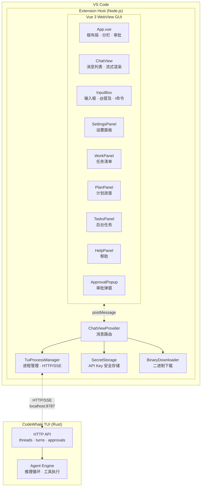

<p align="center">
  
</p>

<h1 align="center">Celest — DeepSeek V4 AI Agent for VS Code</h1>

<p align="center">
  将 <a href="https://github.com/Hmbown/CodeWhale">CodeWhale TUI</a> 的全部能力带入 VS Code<br>
  HTTP/SSE 原生流式 · 工具执行 · Thinking 可视化 · 审批流程 · 多面板
</p>

<p align="center">
  <a href="README.en.md">English</a> | 简体中文
</p>

---

## ✨ 功能

| 功能 | 状态 |
|------|:----:|
| 💬 流式对话 — 实时流式渲染，逐 token 追加 | ✅ |
| 🧠 Thinking 可视化 — reasoning 实时流，折叠可展开 | ✅ |
| 🔧 工具执行 — 工具调用卡片（折叠、状态、结果预览） | ✅ |
| 📋 Work 面板 — 解析 todo_write 展示任务清单 | ✅ |
| 📐 Plan 面板 — 解析 update_plan 展示步骤进度 | ✅ |
| 📌 Tasks 面板 — 后台任务状态跟踪 | ✅ |
| 📁 @ 提及 — 工作区文件自动补全 | ✅ |
| ⚡ / 命令 — 63 个斜杠命令，A-Z 排序，中文别名 | ✅ |
| ❓ Help 面板 — 命令 + 快捷键，分类展示 | ✅ |
| 📂 会话列表 — TreeView 真实数据（Threads API） | ✅ |
| 🔐 审批弹窗 — 工具执行前确认（允许/拒绝/信任会话） | ✅ |
| 📄 Diff 预览 — View Diff → VS Code diff editor | ✅ |
| ⚙ 设置面板 — 通用/模型/关于，API Key 安全存储 | ✅ |
| 🎛️ 模型切换 — 8 模型下拉，PATCH 同步当前线程 | ✅ |
| 🔀 模式切换 — Agent/Plan/YOLO 一键循环，YOLO 跳审 | ✅ |
| 🌐 国际化 — 简体中文 / English 界面切换 | ✅ |
| 📥 二进制下载 — GitHub Release 自动下载 codewhale-tui | ✅ |
| 🖼️ 粘贴图片 — 截图粘贴自动 @path | ✅ |
| ⏹ Stop 按钮 — 中断生成（interrupt API + fallback） | ✅ |
| 🔄 自动重试 — TUI 崩溃指数退避重连 | ✅ |
| 💾 消息持久化 — localStorage 防抖自动保存 | ✅ |
| 🎨 VS Code 主题适配 — 暗色/亮色主题跟随 | ✅ |

## 📦 安装

### 前置条件

- **VS Code** ≥ 1.70.0
- **Node.js** ≥ 18.18.0
- **[CodeWhale TUI](https://github.com/Hmbown/CodeWhale)** ≥ 0.8.44（需已安装并在 PATH 中，或使用内置下载功能）

### 安装步骤

```bash
git clone https://github.com/TheEastKoi/celest.git
cd celest
npm install
npm run build
```

然后在 VS Code 中按 `F5` 启动扩展开发模式，或：

```bash
npx vsce package
code --install-extension celest-*.vsix
```

## 🚀 使用

1. 打开 VS Code，点击侧边栏 🌙 **Celest** 图标
2. 等待 TUI 连接成功（自动启动 `codewhale-tui serve --http`）
3. 输入框输入问题，`Enter` 发送
4. 使用 `@` 提及文件，`/` 浏览命令
5. 右侧面板查看 Work / Plan / Tasks / Help
6. 点击 ⚙ 打开设置面板配置模型和 API Key

### 快捷键

| 键 | 功能 |
|----|------|
| `Enter` | 发送消息 |
| `Shift+Enter` | 换行 |
| `↑↓` (弹窗) | 浏览选项 |
| `Esc` | 关闭弹窗 |
| `Ctrl+L` | 聚焦输入框 |

### 常用命令

| 命令 | 说明 |
|------|------|
| `/help` | 打开帮助面板 |
| `/clear` | 清空对话 |
| `/compact` | 压缩上下文 |
| `/model` | 切换模型 |

> 输入 `/` 浏览全部 63 个命令（含中文别名和分类筛选）

## 🏗️ 架构



## 📁 项目结构

```
celest/
├── src/
│   ├── extension.ts              入口
│   ├── chatViewProvider.ts       WebView 管理 + 消息路由
│   ├── tuiProcessManager.ts      TUI 进程 + HTTP/SSE Threads API
│   ├── sessionsTreeProvider.ts   会话 TreeView
│   ├── secretStorage.ts          API Key 安全存储
│   └── binaryDownloader.ts       GitHub Release 二进制下载
├── gui/src/
│   ├── App.vue                   根布局 + 分栏
│   ├── i18n.ts                   国际化 (zh-CN/en)
│   └── components/
│       ├── ChatView.vue          消息列表
│       ├── InputBox.vue          输入框
│       ├── SettingsPanel.vue     设置面板
│       ├── ContextBar.vue        底部信息栏（模型/模式）
│       ├── ApprovalPopup.vue     审批弹窗
│       ├── WorkPanel.vue         Work 面板
│       ├── PlanPanel.vue         Plan 面板
│       ├── TasksPanel.vue        Tasks 面板
│       └── HelpPanel.vue         Help 面板
├── docs/
│   ├── PLAN.md                   开发计划
│   ├── INTEGRATION_TEST.md       集成测试用例
│   └── TEST_PLAN.md              测试方案
├── build.mjs                     esbuild 构建脚本
└── package.json
```

## 🔧 开发

```bash
cd celest
npm install

# 构建
node build.mjs

# 测试
npx vitest run

# F5 启动调试
```

## 📋 开发阶段

| Phase | 内容 | 状态 |
|-------|------|:----:|
| 0 | 项目骨架 | ✅ |
| 1 | TUI 通信 + Vue GUI | ✅ |
| 2 | 聊天核心强化 (HTTP/SSE) | ✅ |
| 3 | @ / / 面板 + 会话列表 | ✅ |
| 4 | 审批 + 执行 + Diff | ✅ |
| 5 | 设置面板 + 模型/模式切换 + i18n + 二进制下载 | ✅ |
| 6 | 打磨 + Marketplace 发布 | ⏳ |

## 🔄 CodeWhale 迁移

TUI v0.8.40 → v0.8.44 (CodeWhale)，celest 已完全适配。

| 项目 | 旧 | 新 |
|------|-----|-----|
| 二进制 | `deepseek-tui` | `codewhale-tui` |
| 端口 | 7878 | 8787 |
| 仓库 | `deepseek-ai/DeepSeek-TUI` | `Hmbown/CodeWhale` |
| API | 不变 | 不变 |

详见 [docs/PLAN.md](docs/PLAN.md)

## 📄 许可

Apache-2.0

---

<p align="center">
  <sub>Made with 🌙 by <a href="https://github.com/TheEastKoi">TheEastKoi</a></sub>
</p>
