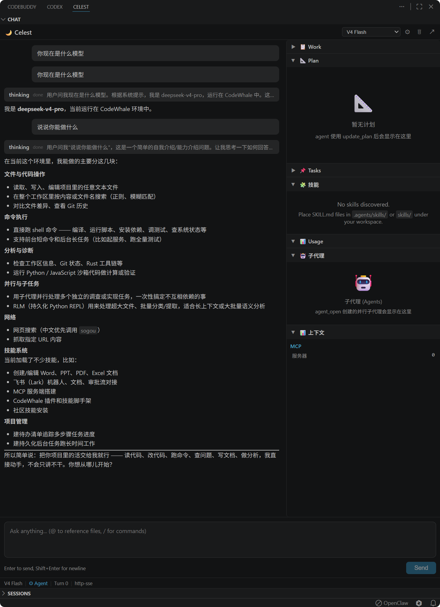
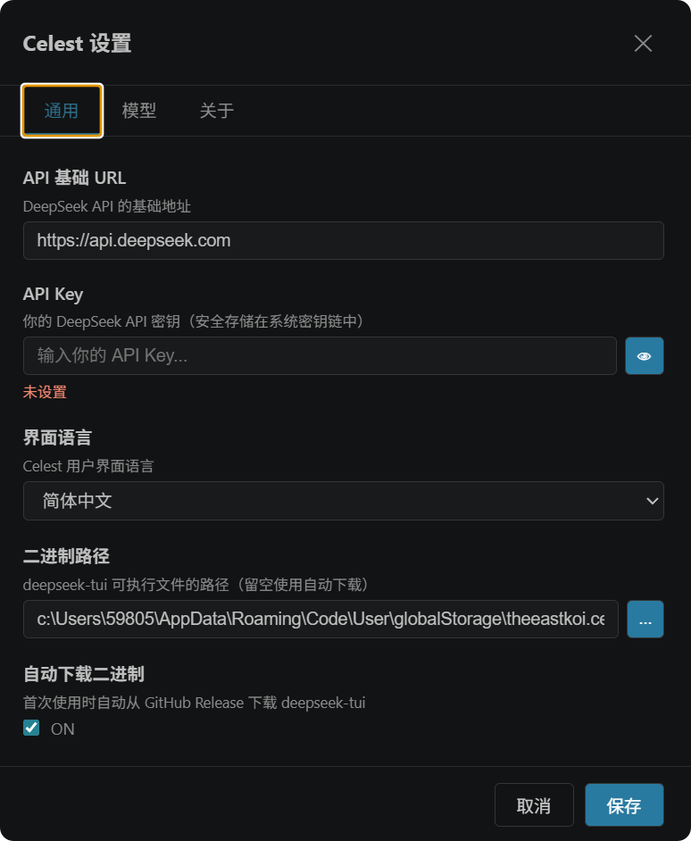
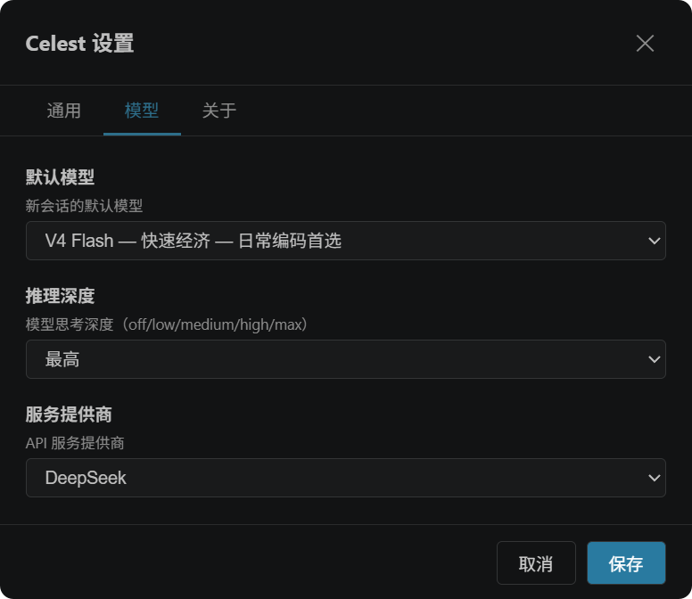
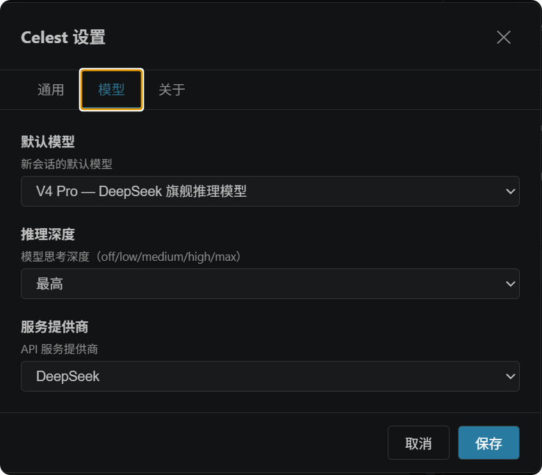

<p align="center">
  
</p>

<h1 align="center">Celest — DeepSeek AI Agent for VS Code</h1>

<p align="center">
  <strong>免费 · 直连 DeepSeek API · 基于 CodeWhale 引擎</strong><br>
  在 VS Code 中拥有完整 AI 编程助手 — 流式对话 · 工具执行 · 多面板 · 全免费
</p>

<p align="center">
  <a href="README.en.md">English</a> | 简体中文
</p>

---

## 为什么选择 Celest？

| | Celest | 其他插件 |
|---|:---:|:---:|
| 💰 价格 | **完全免费** | 付费订阅 |
| 🔗 连接方式 | **直连 DeepSeek API** | 中转服务器 |
| 🧠 后台引擎 | **CodeWhale TUI** (Rust) | 自研/闭源 |
| 🔧 工具执行 | **全量 37 API** | 有限 |
| 📊 右侧面板 | **7 个实时面板** | 1-2 个 |
| 🎯 审批流程 | **Agent/Plan/YOLO** 可切换 | 无 |
| 📁 文件引用 | **@[路径] 彩色标签** | 纯文本 |

---

## ✨ 功能一览

| 功能 | 说明 |
|------|------|
| 💬 流式对话 | HTTP/SSE 原生流式，逐 token 渲染 |
| 🧠 Thinking | reasoning 实时流，折叠可展开 |
| 🔧 工具执行 | 工具卡片（折叠/状态/结果预览/View Diff） |
| 📋 Work 面板 | 任务清单 + 计划进度，自动解析 |
| 📌 Tasks 面板 | 后台任务状态实时跟踪 |
| 🤖 Agents 面板 | 子代理状态实时跟踪 |
| 📊 Context 面板 | Token 用量 + Git 状态 + MCP 计数 |
| 🧩 Skills 面板 | TUI 技能启用/禁用管理 |
| 📈 Usage 面板 | 用量统计，按天/模型/线程分组 |
| 🖼️ 图像识别 | 支持图片粘贴 + OCR 文字提取（需安装 Tesseract） |
| 📁 @ 提及 | 工作区文件自动补全 + 彩色类型标签 |
| ⚡ / 命令 | 57 个斜杠命令，中文别名，列对齐弹窗 |
| ❓ Help 面板 | 命令 + 快捷键参考 |
| 📂 会话管理 | TreeView 会话列表 + 标题 + 删除 |
| 🔐 审批弹窗 | 工具执行确认，低影响自动批准 |
| ⚙ 设置面板 | API Key 安全存储 + 模型切换 + i18n |
| 🗜 上下文压缩 | /compact 命令 + 按钮，减少 token |
| ⏹ Stop 打断 | 中断当前生成 + async interrupt |
| 🌐 国际化 | 简体中文 / English |
| 📥 自动下载 | codewhale-tui 一键下载 + 更新 |

---

## 📸 截图

<p align="center">
  
  <br><em>完整工作界面 — 聊天 + 7 个右侧面板 + Sessions + 文件标签</em>
</p>

<details>
<summary>⚙ 设置面板</summary>
<p align="center">
  
  
  
</p>
</details>

---

## 📦 安装

### 前置条件

- **VS Code** ≥ 1.70.0
- **Node.js** ≥ 18
- **DeepSeek API Key** ([免费获取](https://platform.deepseek.com))

### 快速开始

```bash
git clone https://github.com/TheEastKoi/celest.git
cd celest
npm install
npm run build
```

VS Code 按 `F5` 启动，或：

```bash
npx vsce package
code --install-extension celest-*.vsix
```

打开 Celest 面板 → 设置 API Key → 开始使用。

---

## 🚀 使用

### 基本操作

| 操作 | 方式 |
|------|------|
| 发送消息 | `Enter` |
| 换行 | `Shift+Enter` |
| 停止生成 | 点击 `⏹ Stop` |
| 新建会话 | 顶栏 `＋` |
| 压缩上下文 | 顶栏 `🗜` 或输入 `/compact` |
| 清空聊天 | 输入 `/clear` |
| 打开帮助 | 输入 `/help` |

### 引用文件

- **`@` 弹窗** — 输入 `@` → 搜索并选择工作区文件
- **`Ctrl+Shift+L`** — 在资源管理器中选文件 → 快捷键添加
- **粘贴路径** — 复制文件路径粘贴 → 自动格式化为 `@[路径]`
- **文件标签** — 聊天区中 `@[路径]` 渲染为彩色类型标签，hover 显示路径，点击打开
- **图像识别** — 粘贴图片后 AI 可读取文字内容（需安装 [Tesseract OCR](https://github.com/UB-Mannheim/tesseract/wiki)，设置 → 关于 查看状态）

### 命令

- **`/` 弹窗** — 输入 `/` → 浏览 57 个命令（支持中文搜索）
- **常用命令**: `/clear` `/compact` `/help` `/model` `/mode` `/doctor` `/context`

### 模型与模式

- **模型切换** — 底部栏下拉框选择（V4 Pro / V4 Flash 等）
- **模式切换** — 底部栏点击 Mode 循环：Agent（审批）→ Plan（计划）→ YOLO（自动执行）
- **审批流程** — Agent 模式下工具执行前弹窗确认，低影响工具自动批准

---

## 🏗️ 项目结构

```
celest/
├── src/                          # 扩展后端 (TypeScript)
│   ├── extension.ts              # 入口：命令注册 + 视图挂载
│   ├── chatViewProvider.ts       # WebView 管理 + 消息路由
│   ├── tuiProcessManager.ts      # TUI 进程 + HTTP/SSE 37 API
│   ├── sessionsTreeProvider.ts   # 会话 TreeView
│   ├── secretStorage.ts          # API Key 安全存储
│   ├── binaryDownloader.ts       # GitHub Release 二进制下载
│   └── logger.ts                 # 统一日志
├── gui/src/                      # 前端界面 (Vue 3)
│   ├── App.vue                   # 根布局 + 分栏 + 审批
│   ├── i18n.ts                   # 国际化 (zh-CN / en)
│   ├── helpData.ts               # 57 命令 + 5 快捷键数据
│   ├── global.css                # 全局样式 + 文件标签
│   └── components/
│       ├── ChatView.vue          # 消息列表 + 流式渲染
│       ├── InputBox.vue          # 输入框 + @提及 + /命令
│       ├── MarkdownRenderer.vue  # Markdown 渲染 (highlight.js)
│       ├── ThinkingBlock.vue     # Thinking 折叠块
│       ├── ContextBar.vue        # 底部栏（模型/模式/Git）
│       ├── SettingsPanel.vue     # 设置面板（通用/模型/关于）
│       ├── ApprovalPopup.vue     # 审批弹窗
│       ├── WorkPanel.vue         # Work 面板（任务+计划）
│       ├── TasksPanel.vue        # Tasks 面板
│       ├── AgentsPanel.vue       # Agents 面板
│       ├── ContextPanel.vue      # Context 面板
│       ├── SkillsPanel.vue       # Skills 面板
│       ├── UsagePanel.vue        # Usage 面板
│       ├── HelpPanel.vue         # Help 面板
│       ├── AtMentionPopup.vue    # @ 文件弹窗
│       └── SlashCommandPopup.vue # / 命令弹窗
├── docs/
│   ├── PLAN.md                   # 开发计划
│   ├── INTEGRATION_TEST.md       # 集成测试手册
│   ├── CHANGELOG.md             # 变更日志
│   └── BUGLOG.md                 # 问题记录
├── build.mjs                     # esbuild 构建脚本
└── package.json
```

## 🔧 开发

```bash
cd celest
npm install

# 构建
node build.mjs

# 测试
npx vitest run

# F5 启动调试
```

## 📋 开发阶段

| Phase | 内容 | 状态 |
|-------|------|:----:|
| 0 | 项目骨架 | ✅ |
| 1 | TUI 通信 + Vue GUI | ✅ |
| 2 | 聊天核心强化 (HTTP/SSE) | ✅ |
| 3 | @ / / 面板 + 会话列表 | ✅ |
| 4 | 审批 + 执行 + Diff | ✅ |
| 5 | 设置面板 + 模型/模式 + i18n + 下载 | ✅ |
| 6 | 全量 API 适配 + 面板对齐 + UT | ✅ |
| 6.4 | 封闭测试修复 (26 bug + 10 feature) | ✅ |

## 🔄 后台引擎

Celest 基于 [CodeWhale TUI](https://github.com/Hmbown/CodeWhale)，通过 HTTP/SSE 协议与 TUI 的 37 个 Runtime API 通信。TUI 进程由 Celest 自动管理（启动/重启/更新），用户无需手动操作。

| 项目 | 说明 |
|------|------|
| 引擎 | CodeWhale TUI v0.8.46 (Rust) |
| 通信 | HTTP/SSE (localhost:8787) |
| API 覆盖 | 37/37 (100%) |
| 自动下载 | GitHub Release → 一键安装 |

---

## 📄 许可

Apache-2.0

---

<p align="center">
  <sub>Made with 🌙 by <a href="https://github.com/TheEastKoi">TheEastKoi</a></sub>
</p>
