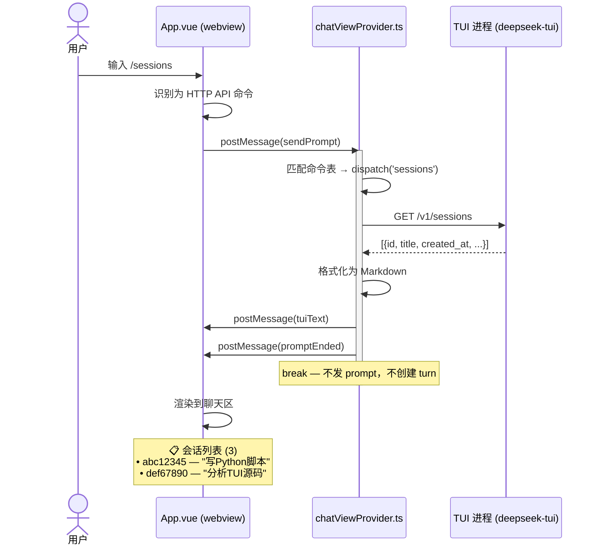
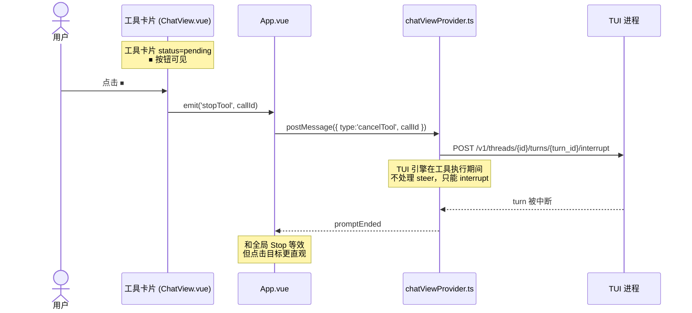

# Celest 插件问题分析与修改方案

> 版本：v0.1.1  
> 日期：2026-05-31  
> 范围：仅修改 celest TypeScript/Vue 代码，不修改 TUI Rust 二进制

---

## 问题 1：多 VSCode 窗口 Session 串行

### 现象

切换 VSCode 窗口后，A 窗口的对话出现在 B 窗口的会话中。Session 没有与具体窗口绑定。

### 根因

```
extension.ts:16  →  const tuiManager = new TuiProcessManager(context)
                 →  整个 extension 只有 一个 TuiProcessManager 实例
                 →  所有窗口共享 _currentThreadId
```

- `TuiProcessManager._currentThreadId` 是单例状态
- 窗口 A 发 prompt 创建 thread_A，`_currentThreadId = thread_A`
- 窗口 B 发 prompt 时复用 `_currentThreadId`，直接往 thread_A 追加对话
- TUI 进程只有一个，HTTP API 是无状态的——谁调用就操作当前 thread

### 解法

**核心思路**：每个 VSCode 窗口维护独立的 `threadId`，通过 `vscode.env.sessionId` 区分窗口。

```
改动点 1: tuiProcessManager.ts
- _currentThreadId 改为 Map<windowId, threadId>
- sendPrompt() 根据当前窗口 ID 查找/创建 thread
- 新增 switchToWindow(windowId) 方法

改动点 2: extension.ts  
- 使用 vscode.env.sessionId 作为窗口标识
- 传递给 TuiProcessManager

改动点 3: chatViewProvider.ts
- resumeSession 前先切换 thread 上下文
- newSession 只清空当前窗口的 thread
```


| 文件                   | 改动                                                                               |
| ---------------------- | ---------------------------------------------------------------------------------- |
| `tuiProcessManager.ts` | `_currentThreadId` → `_threadMap: Map<string, string>`；`sendPrompt()` 按窗口路由 |
| `extension.ts`         | 传入`vscode.env.sessionId` 作为窗口标识                                            |
| `chatViewProvider.ts`  | `resumeSession`/`newSession` 传递窗口 ID                                           |

---

## 问题 2：`/` 斜杠命令没有本地执行

### 现象

输入 `/memory`、`/skill`、`/sessions` 等命令后，被当作普通对话文本发送给 TUI。TUI 把 `/command` 当成普通对话发给 LLM，而不是执行命令。

### 根因

```typescript
// App.vue 第 216-219 行 — 只拦截了 3 个命令
if (t === '/clear') { handleClearChat(); return; }
if (t === '/help' || t === '/?') { helpPanelRef.value?.show(); return; }
if (t === '/compact') { vscode?.postMessage({ type: 'compactThread' }); return; }
// 其余全部走 ↓
vscode?.postMessage({ type: 'sendPrompt', prompt: text });
```

### 解法

**核心思路**：celest 模拟 TUI 的斜杠命令行为。50+ 个命令分三类处理：


| 类别              | 处理方式                                                       | 示例                                           |
| ----------------- | -------------------------------------------------------------- | ---------------------------------------------- |
| **本地 UI 命令**  | webview 直接响应，不走后端                                     | `/clear`、`/help`                              |
| **HTTP API 命令** | chatViewProvider 调用 TUI HTTP API，结果格式化为系统消息渲染   | `/sessions`、`/skills`、`/mcp`、`/memory show` |
| **Steer 命令**    | 通过`POST /v1/threads/{id}/turns/{turn_id}/steer` 注入到对话流 | `/doctor`、`/diff`、`/config`                  |

**核心原则：能本地处理的绝不找 TUI，能 HTTP API 的绝不消耗 LLM token。**

---

### 架构数据流（以 `/sessions` 为例）



**和普通 LLM 回复的关键区别**：

- 响应是**即时**的（HTTP API 调用通常 < 100ms，零 token 消耗）
- 没有 reasoning/thinking 块、没有 tool call 卡片
- 内容为固定格式的系统消息
- `break` 跳出 switch，**不创建 turn、不消耗 LLM 配额**

---

### 命令分派实现

#### 命令表定义 (`helpData.ts` 扩展)

```typescript
// 给现有 SlashCommand 增加 handler 字段
export interface SlashCommand {
    name: string;
    zhName: string;
    description: string;
    category: string;
    handler: 'local' | 'api' | 'steer';  // ← 新增
}

// 示例 — 只列出 handler 字段值，其余字段不变
// /clear       → handler: 'local'
// /help        → handler: 'local'
// /sessions    → handler: 'api'
// /skills      → handler: 'api'
// /mcp         → handler: 'api'
// /memory      → handler: 'api'
// /doctor      → handler: 'steer'
// /diff        → handler: 'steer'
```

#### 命令分派器 (`chatViewProvider.ts` 新增)

在 `handleWebviewMessage` 的 `sendPrompt` 分支中，紧跟 `/compact` 检查之后：

```typescript
// ── 命令分派表（静态定义，不打乱 handleWebviewMessage 结构）──
private static readonly SLASH_DISPATCH: Record<string, (mgr: TuiProcessManager, args: string) => Promise<string | null>> = {
    // ═══ HTTP API 类 ═══
    sessions: async (mgr) => {
        const list = await mgr.listSessions(50);
        if (list.length === 0) return '📋 没有保存的会话。';
        return '📋 **会话列表** (' + list.length + ')\n\n'
            + list.map(s => `• \`${s.id.slice(0,8)}\` — ${s.title || '(无标题)'} (${s.updated_at?.slice(0,10) || '?'})`).join('\n');
    },
    skills: async (mgr) => {
        const data = await mgr.listSkills();
        if (!data || data.skills.length === 0) return '🧩 没有已安装的技能。';
        return '🧩 **技能列表** (' + data.skills.length + ')\n\n'
            + data.skills.map(s => `• **${s.name}** — ${s.description} ${s.enabled ? '✅' : '⏸'}`).join('\n');
    },
    mcp: async (mgr) => {
        const [servers, tools] = await Promise.all([mgr.listMcpServers(), mgr.listMcpTools()]);
        const lines = [`🔌 **MCP 服务器** (${servers.length})`];
        for (const s of servers) lines.push(`• ${(s as any).name || (s as any).id || '?'}`);
        lines.push('', `🔧 **MCP 工具** (${tools.length})`);
        for (const t of tools.slice(0, 20)) lines.push(`• \`${(t as any).name || (t as any).id}\``);
        if (tools.length > 20) lines.push(`… 还有 ${tools.length - 20} 个工具`);
        return lines.join('\n');
    },
    tasks: async (mgr) => {
        const tasks = await mgr.listTasks();
        if (tasks.length === 0) return '📌 没有后台任务。';
        return '📌 **后台任务** (' + tasks.length + ')\n\n'
            + tasks.map(t => `• \`${(t as any).id?.slice(0,8)}\` [${(t as any).status}] ${(t as any).summary || ''}`).join('\n');
    },
    version: async (mgr) => {
        const info = await mgr.getRuntimeInfo();
        return `🌙 **Celest / CodeWhale TUI**\n版本: ${info?.version || '未知'}\n端口: ${info?.port || '?'}`;
    },
    models: async (mgr) => {
        // 本地静态列表（不调API），这里用 mgr 仅为保持签名一致
        return '🤖 **可用模型**\n\n• `deepseek-v4-flash` (默认, 快速)\n• `deepseek-v4-pro` (深度推理)\n\n切换: `/model <名称>`';
    },

    // ═══ 本地文件类 ═══
    memory: async (_mgr, args) => {
        const sub = args.trim();
        const memPath = path.join(os.homedir(), '.deepseek', 'memory.md');
        if (sub === 'clear') {
            await fs.promises.writeFile(memPath, '', 'utf-8');
            return '🧠 记忆已清空。用 `# 记住：xxx` 重新添加。';
        }
        try {
            const content = await fs.promises.readFile(memPath, 'utf-8');
            if (!content.trim()) return '🧠 记忆为空。在任意对话中输入 `# 记住：xxx` 添加。';
            return `🧠 **当前记忆**\n\n\`\`\`markdown\n${content.slice(0, 3000)}\n\`\`\``;
        } catch {
            return '🧠 记忆文件不存在。在 `~/.deepseek/config.toml` 中启用 `[memory] enabled = true`。';
        }
    },

    // ═══ Steer 类（转发给 TUI 处理）═══
    // 返回 null 表示已通过 steer 注入，后续走 SSE 流式返回
    doctor: async (mgr) => { return ChatViewProvider.steerToTui(mgr, '/doctor'); },
    diff:   async (mgr) => { return ChatViewProvider.steerToTui(mgr, '/diff'); },
    config: async (mgr) => { return ChatViewProvider.steerToTui(mgr, '/config'); },
    context:async (mgr) => { return ChatViewProvider.steerToTui(mgr, '/context'); },
    cost:   async (mgr) => { return ChatViewProvider.steerToTui(mgr, '/cost'); },
    tokens: async (mgr) => { return ChatViewProvider.steerToTui(mgr, '/tokens'); },
    status: async (mgr) => { return ChatViewProvider.steerToTui(mgr, '/status'); },
    system: async (mgr) => { return ChatViewProvider.steerToTui(mgr, '/system'); },
    recall: async (mgr) => { return ChatViewProvider.steerToTui(mgr, '/recall'); },
};

/** 将命令转发给 TUI 通过 steer API 处理 */
private static async steerToTui(mgr: TuiProcessManager, cmd: string): Promise<null> {
    const tid = (mgr as any)._currentThreadId;
    const turnId = (mgr as any)._currentTurnId;
    if (tid && turnId) {
        await mgr.steerTurn(tid, turnId, cmd);
    }
    return null; // null → 调用方等待 SSE 流式返回
}
```

#### 在 `sendPrompt` 分支中的调用

```typescript
case 'sendPrompt': {
    const prompt = String(msg.prompt || '').trim();
    if (!prompt) return;

    // ── 第一步：斜杠命令拦截 ──
    const slashMatch = prompt.match(/^\/(\S+)(?:\s+(.*))?$/);
    if (slashMatch) {
        const [, cmd, args] = slashMatch;

        // 1) 本地 UI 命令 — 已在 App.vue 中拦截，不会到达这里
        // 2) /compact — 已有独立处理
        if (cmd === 'compact') { /* ... 已有逻辑 ... */ break; }

        // 3) HTTP API / Steer 命令
        const handler = ChatViewProvider.SLASH_DISPATCH[cmd];
        if (handler) {
            this.postMessage({ type: 'tuiUserMessage', text: prompt }); // 回显用户输入
            const result = await handler(this.tuiManager, args || '');
            if (result !== null) {
                this.postMessage({ type: 'tuiText', text: result, sessionId: 'http-sse' });
                this.postMessage({ type: 'promptEnded' });
            }
            // result === null → steer 已发送，等待 SSE 流式返回
            break;
        }
        // 未匹配 — 当作普通对话发给 LLM
    }

    // ── 第二步：正常 prompt 流程 ──
    const wsRoot = vscode.workspace.workspaceFolders?.[0]?.uri.fsPath || '';
    // ... 原有 sendPrompt 逻辑
}
```

#### WebView 新增消息类型

```typescript
// App.vue — 新增 tuiUserMessage 处理
case 'tuiUserMessage':
    chatRef.value?.addUserMessage(msg.text);
    break;
```

---

### 完整命令映射表

> ✅ = 已实现 &nbsp;&nbsp; ⬜ = 待实现

| 命令 | 类别 | 状态 | 实现方式 |
|------|:--:|:--:|------|
| `/clear` | local | ✅ | webview 直接清屏 |
| `/help` | local | ✅ | 弹出帮助面板 |
| `/compact` | api | ✅ | `POST /v1/threads/{id}/compact` |
| `/sessions` | api | ✅ | `GET /v1/sessions`，结果格式化渲染 |
| `/skills` | api | ✅ | `GET /v1/skills`，结果格式化渲染 |
| `/mcp` | api | ✅ | `GET /v1/apps/mcp/servers` + `/tools` |
| `/tasks` | api | ✅ | `GET /v1/tasks`，结果格式化渲染 |
| `/version` | api | ✅ | `GET /v1/runtime/info` |
| `/models` | api | ✅ | 本地静态列表 |
| `/memory` | api | ✅ | 读/写 `~/.deepseek/memory.md`（UTF-8/GBK 自动检测） |
| `/new` | api | ✅ | `newSession()` |
| `/load <id>` | api | ✅ | `resumeSession(id)` |
| `/rename <name>` | api | ✅ | `PATCH /v1/threads/{id}` |
| `/fork` | api | ✅ | `POST /v1/threads/{id}/fork` |
| `/mode <mode>` | api | ✅ | 本地状态 + PATCH |
| `/model <model>` | api | ✅ | 本地状态 + PATCH |
| `/skill <name>` | api | ✅ | `POST /v1/skills/{name}` |
| `/task <id>` | api | ✅ | `GET /v1/tasks/{id}` |
| `/doctor` | steer | ⬜ | `POST /steer` 注入 |
| `/diff` | steer | ⬜ | `POST /steer` 注入 |
| `/config` | steer | ⬜ | `POST /steer` 注入 |
| `/context` | api | ✅ | `GET /v1/usage?group_by=thread` |
| `/cost` | api | ✅ | `GET /v1/usage?group_by=day` |
| `/tokens` | api | ✅ | `GET /v1/usage?group_by=day` |
| `/status` | steer | ⬜ | `POST /steer` 注入 |
| `/system` | steer | ⬜ | `POST /steer` 注入 |
| `/recall` | steer | ⬜ | `POST /steer` 注入 |
| `/note` | steer | ⬜ | `POST /steer` 注入 |
| 其余… | steer | ⬜ | 透传给 TUI 处理 |

> 已实现 21 个命令（2 local + 19 api），待实现 8 个 steer 类（需 TUI 运行时状态）。

---

### 需新增的 API 封装


| 方法                                  | HTTP 端点                                     | 所在文件               |
| ------------------------------------- | --------------------------------------------- | ---------------------- |
| `steerTurn(threadId, turnId, prompt)` | `POST /v1/threads/{id}/turns/{turn_id}/steer` | `tuiProcessManager.ts` |
| `forkThread(threadId)`                | `POST /v1/threads/{id}/fork`                  | `tuiProcessManager.ts` |

---

### 改动文件清单


| 文件                   | 改动                                                                                       |
| ---------------------- | ------------------------------------------------------------------------------------------ |
| `chatViewProvider.ts`  | 新增`SLASH_DISPATCH` 静态命令表 + `steerToTui()` 辅助方法；`sendPrompt` 分支中前置命令拦截 |
| `tuiProcessManager.ts` | 新增`steerTurn()`、`forkThread()` API 封装                                                 |
| `App.vue`              | 新增`tuiUserMessage` 消息处理；扩展 `handleSend` 命令拦截（不做大改）                      |
| `helpData.ts`          | `SlashCommand` 接口增加 `handler` 字段                                                     |

---

## 问题 3：需要停止单个工具执行但不中断会话

### 现象

用户点击底部 Stop 按钮后整个 turn 被中断。期望：只停止当前正在跑的 `exec_shell` 命令，让模型收到"已取消"反馈后继续处理。

### 根因

```typescript
// InputBox.vue — 全局 Stop 只做一件事：中断整个 turn
handleStop() → cancelPrompt → POST /interrupt → engine.cancel()
```

TUI `/interrupt` 是 turn 级别取消，无法精细到单个工具。且 InputBox 底部按钮距离工具卡片较远，用户难以建立"这个按钮能停那个命令"的心智模型。

### 解法

**核心思路：全局 Stop 保持简单（中断 turn），工具卡片上加 ⏹ 小按钮（取消命令）。**

```
┌─ 工具卡片 (status=pending) ──────────────────────┐
│ ▶ 🔧 exec_shell  [pending] [⏹]  "npm install..." │
└───────────────────────────────────────────────────┘
                              ↑
                         仅在 pending 时出现
                         点击 → steer 注入取消消息
```

#### 和全局 Stop 的对比

| | 全局 Stop ⏹ | 工具卡片 ⏹ |
|---|---|---|
| 位置 | InputBox 底部固定 | 工具卡片 header 内联 |
| 作用域 | 中断整个 turn | 取消当前这一个工具 |
| 效果 | 对话结束 | 模型收到取消 → 继续生成 |
| 显示条件 | 始终可见（生成中） | 仅 `status === 'pending'` |
| 改动 | **不动，保持现状** | 新增 |

#### 架构数据流



#### 实现细节

**1. ChatView.vue — 工具卡片 header 加 ⏹**

```html
<div class="tool-call-header">
    <span class="tool-collapse-icon">{{ part._collapsed === false ? '▼' : '▶' }}</span>
    <span class="tool-icon">🔧</span>
    <span class="tool-name">{{ part.toolName }}</span>
    <span class="tool-status" :class="'status-' + part.status">{{ part.status }}</span>
    <!-- 新增：仅在 pending 时显示 -->
    <button v-if="part.status === 'pending'"
            class="tool-stop-btn"
            @click.stop="emit('stopTool', part.callId)"
            title="停止此命令">⏹</button>
    <span v-if="part.result && part._collapsed !== false" class="tool-result-preview">
        {{ toolResultPreview(part.result) }}
    </span>
</div>
```

CSS：

```css
.tool-stop-btn {
    background: none; border: 1px solid var(--vscode-panel-border);
    color: var(--vscode-errorForeground); cursor: pointer;
    font-size: 12px; padding: 0 5px; border-radius: 3px;
    margin-left: 4px; line-height: 1.4;
}
.tool-stop-btn:hover {
    background: var(--vscode-inputValidation-errorBackground);
    border-color: var(--vscode-inputValidation-errorBorder);
}
```

**2. App.vue — 事件转发**

```typescript
// ChatView 模板新增
<ChatView ref="chatRef" @viewDiff="handleViewDiff" @stopTool="handleStopTool" />

// 处理函数
function handleStopTool(callId: string) {
    vscode?.postMessage({ type: 'cancelTool', callId });
}
```

**3. chatViewProvider.ts — steer 注入**

```typescript
case 'cancelTool': {
    const callId = String(msg.callId || '');
    await this.cancelCurrentTool(callId);
    break;
}

// 新增方法
private async cancelCurrentTool(callId: string): Promise<void> {
    const tid = (this.tuiManager as any)._currentThreadId;
    const turnId = (this.tuiManager as any)._currentTurnId;
    if (!tid || !turnId) return;

    const steerMsg = `USER INTERRUPTION: The tool call "${callId}" was cancelled by the user. 
Please treat this tool as having returned an error: "Cancelled by user". 
Do NOT retry this tool. Continue with the next step.`;

    await this.tuiManager.steerTurn(tid, turnId, steerMsg);
}
```

#### 改动清单

| 文件 | 改动 |
|------|------|
| `ChatView.vue` | 工具卡片 header 加条件渲染的 `⏹` 按钮 + `emit('stopTool', callId)` |
| `App.vue` | 新增 `handleStopTool(callId)` → `postMessage({ type:'cancelTool' })` |
| `chatViewProvider.ts` | 新增 `cancelCurrentTool()` → steer 注入取消消息 |
| `tuiProcessManager.ts` | 新增 `steerTurn(threadId, turnId, prompt)` API 封装 |
| `InputBox.vue` | **不动**，保持现有单一全局 Stop |

改动量约 40 行（3 个文件各一小段），InputBox 完全不动。

---

## 问题 4：对话框内容没有自动下滑到最下方

### 根因

```typescript
// ChatView.vue 第 418-424 行
function scrollToBottom() {
    nextTick(() => {
        if (scrollContainer.value) {
            scrollContainer.value.scrollTop = scrollContainer.value.scrollHeight;
        }
    });
}
```

`nextTick` 在 Vue DOM 更新后触发，但：

- 大段 Markdown 渲染需要多个 tick 才能完成布局
- `loadHistory` 批量插入历史消息后没有触发滚动
- `scrollToBottom` 被频繁调用但时机不对

### 解法

```typescript
function scrollToBottom(immediate = false) {
    const doScroll = () => {
        const el = scrollContainer.value;
        if (!el) return;
        el.scrollTop = el.scrollHeight;
    };
    if (immediate) {
        doScroll();
    } else {
        nextTick(() => {
            doScroll();
            // 大段 Markdown 渲染后需要二次确认
            requestAnimationFrame(() => doScroll());
        });
    }
}
```

**额外改动**：

- `loadHistory` 完成后调用 `scrollToBottom(true)`
- session 恢复完成后触发滚动


| 文件           | 改动                                                                             |
| -------------- | -------------------------------------------------------------------------------- |
| `ChatView.vue` | `scrollToBottom` 增加 `requestAnimationFrame` 二次确认；`loadHistory` 后触发滚动 |

---

## 问题 5：回答时向上滑动会自动滚到底

### 根因

每次 `appendText` / `appendReasoning` / `updateToolResult` / `addToolCall` 都无条件调用 `scrollToBottom()`。用户手动向上滚动后，下一个 streaming delta 到来时立刻被拉回底部。

### 解法

**核心思路**：追踪"用户是否主动滚离底部"，如果用户在看历史内容，暂停自动滚动。

```typescript
// 新增状态
const userScrolledUp = ref(false);
const SCROLL_THRESHOLD = 50; // 距离底部 50px 以内视为"在底部"

// 监听用户滚动
function onScroll() {
    const el = scrollContainer.value;
    if (!el) return;
    const distFromBottom = el.scrollHeight - el.scrollTop - el.clientHeight;
    userScrolledUp.value = distFromBottom > SCROLL_THRESHOLD;
}

// 修改 scrollToBottom
function scrollToBottom(force = false) {
    if (!force && userScrolledUp.value) return; // 用户在看历史，不打扰
    // ... 原有逻辑
}
```

**自动恢复滚动的时机**（清除 `userScrolledUp`）：

- 用户手动滚回底部时
- 新的一轮对话开始时（用户发了新 prompt）
- assistant 消息完成时（`promptEnded`）


| 文件           | 改动                                                                    |
| -------------- | ----------------------------------------------------------------------- |
| `ChatView.vue` | 新增`userScrolledUp` 状态 + `onScroll` 监听 + `scrollToBottom` 条件判断 |
| `App.vue`      | `promptEnded` 时重置 `userScrolledUp`；发送新 prompt 时重置             |

---

## 问题 6：Session 恢复显示了思考过程和中间结果

### 现象

点击 session 恢复后，不仅显示了最终回答，还显示了 reasoning、中间 tool call 等过程内容。

### 根因

```typescript
// chatViewProvider.ts 第 276-290 行
for (const turn of detail.turns) {
    // ...
    for (const itemId of t.item_ids) {
        const it = itemMap.get(itemId);
        if (it && it.kind === 'agent_message' && it.detail) {
            history.push({ role: 'assistant', content: String(it.detail) });
        }
    }
}
```

- 只过滤了 `kind === 'agent_message'`，但 `agent_message` 的 `detail` 里可能包含模型在过程中的自言自语
- 没有检查 `item.status`，interrupted 的消息也被渲染了
- TUI 的 `ThreadDetail.items` 包含所有类型的 item（reasoning、tool_call、agent_message 等）

### 解法

**核心思路**：恢复时只显示用户真正关心的内容。

```typescript
for (const turn of detail.turns) {
    const t = turn as any;
  
    // 1. 跳过 interrupted 的 turn（被用户手动停止的）
    if (t.status === 'interrupted' || t.status === 'canceled') {
        // 渲染一条提示信息
        history.push({ role: 'assistant', content: '> ⚠️ 此轮对话被中断' });
        continue;
    }
  
    // 2. 只渲染最终 agent_message，跳过 reasoning
    if (Array.isArray(t.item_ids)) {
        for (const itemId of t.item_ids) {
            const it = itemMap.get(itemId);
            if (!it) continue;
          
            // 跳过 interrupted 的 item
            if (it.status === 'interrupted') continue;
          
            // 只渲染最终的 agent_message（跳过 agent_reasoning）
            if (it.kind === 'agent_message' && it.detail) {
                history.push({ role: 'assistant', content: String(it.detail) });
            }
        }
    }
}
```

**额外**：对于被中断的 turn，恢复原始 prompt 到输入框，方便用户重试。


| 文件                  | 改动                                                                               |
| --------------------- | ---------------------------------------------------------------------------------- |
| `chatViewProvider.ts` | `resumeSession()` 中的历史渲染逻辑：检查 `turn.status`、`item.status`、`item.kind` |
| `App.vue`             | `loadHistory` 支持渲染系统提示消息（中断提示）                                     |

---

## 修改文件清单总览


| 文件                   | 涉及问题                                                                           |
| ---------------------- | ---------------------------------------------------------------------------------- |
| `tuiProcessManager.ts` | 问题1（窗口隔离）、问题3（steerTurn API）                                          |
| `chatViewProvider.ts`  | 问题1（窗口隔离）、问题2（斜杠命令）、问题3（工具取消）、问题6（session 恢复过滤） |
| `extension.ts`         | 问题1（传入窗口 ID）                                                               |
| `App.vue`              | 问题3（双按钮逻辑）、问题5（滚动控制）、问题6（中断提示渲染）                      |
| `ChatView.vue`         | 问题4（滚动修复）、问题5（用户滚动检测）                                           |
| `InputBox.vue`         | 问题3（Stop 按钮拆分）                                                             |
| `helpData.ts`          | 问题2（命令分类字段）                                                              |

---

## 优先级建议


| 优先级 | 问题                          | 理由                                  |
| ------ | ----------------------------- | ------------------------------------- |
| **P0** | 问题5（自动滚回底部）         | 严重影响使用，每次 streaming 都被打断 |
| **P0** | 问题6（session 恢复内容过多） | 用户感知的明显 bug                    |
| **P1** | 问题4（不自动滚到底）         | 加载历史后体验差                      |
| **P1** | 问题3（停止按钮）             | 用户明确提出的需求                    |
| **P2** | 问题2（/ 命令）               | 功能缺失但不阻塞使用                  |
| **P2** | 问题1（窗口隔离）             | 多窗口场景特定，但架构改动较大        |
